# Live Poll Demo - Comprehensive Codebase Analysis

## Executive Summary

This repository contains a modern, full-stack live polling application built with cutting-edge web technologies. The application enables users to create, participate in, and analyze real-time polls with sophisticated authentication, role-based access control, and comprehensive analytics.

## Table of Contents

1. [Product Overview](#product-overview)
2. [Technical Architecture](#technical-architecture)
3. [Technology Stack](#technology-stack)
4. [Data Model & Schema](#data-model--schema)
5. [Authentication & Authorization](#authentication--authorization)
6. [Frontend Architecture](#frontend-architecture)
7. [Backend Architecture](#backend-architecture)
8. [User Experience Design](#user-experience-design)
9. [Security Analysis](#security-analysis)
10. [Performance Considerations](#performance-considerations)
11. [Development Workflow](#development-workflow)
12. [Scalability & Future Considerations](#scalability--future-considerations)
13. [Code Quality & Maintainability](#code-quality--maintainability)

---

## Product Overview

### Vision & Purpose
The Live Poll Demo is a sophisticated polling platform designed to facilitate real-time engagement through interactive polls. It serves as both a practical tool for gathering opinions and a demonstration of modern web development best practices.

### Key Features

#### Core Functionality
- **Poll Creation**: Intuitive interface for creating polls with multiple options
- **Real-time Voting**: Live voting with instant result updates
- **Poll Management**: Complete lifecycle management (create, active, complete)
- **Analytics Dashboard**: Comprehensive statistics and visualizations
- **Role-based Access**: Admin controls for platform management

#### User Experience
- **Responsive Design**: Mobile-first approach with dark/light theme support
- **Real-time Updates**: Live synchronization of poll data across sessions
- **Accessibility**: Proper ARIA labels and keyboard navigation
- **Progressive Enhancement**: Works across different device capabilities

### Target Audience
- **Primary**: Organizations needing quick feedback mechanisms
- **Secondary**: Educators conducting classroom polls
- **Tertiary**: Event organizers gathering audience input

---

## Technical Architecture

### High-Level System Architecture

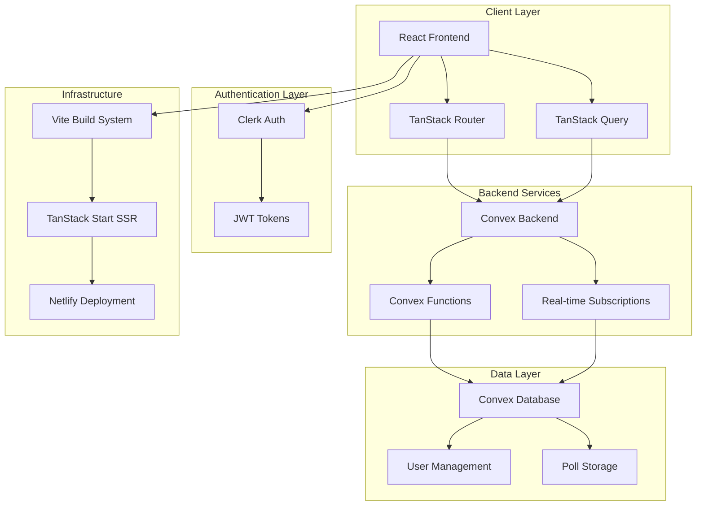

### Data Flow Architecture

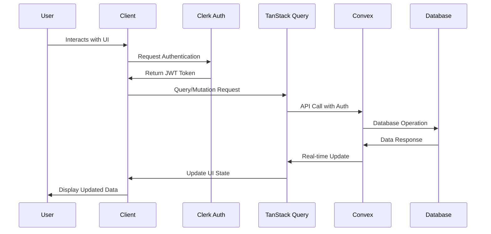

---

## Technology Stack

### Frontend Technologies

#### Core Framework
- **React 19**: Latest version with concurrent features
- **TypeScript**: Full type safety and developer experience
- **Vite 6.3.5**: Lightning-fast build tool and dev server

#### Routing & State Management
- **TanStack Router**: Type-safe routing with search params
- **TanStack Query**: Server state management with caching
- **TanStack Start**: Full-stack React framework with SSR

#### UI & Styling
- **Tailwind CSS 4.1.9**: Utility-first CSS framework
- **Radix UI**: Accessible, unstyled UI primitives
- **Lucide React**: Modern icon library
- **Recharts**: Data visualization library

#### Form Management
- **React Hook Form**: Performant forms with minimal re-renders
- **Zod**: Runtime type validation and schema parsing

### Backend Technologies

#### Database & Backend-as-a-Service
- **Convex**: Real-time backend with TypeScript functions
- **Convex React Query**: Integration between Convex and TanStack Query

#### Authentication
- **Clerk**: Complete authentication and user management
- **JWT**: Secure token-based authentication

#### Development Tools
- **pnpm**: Fast, disk space efficient package manager
- **TypeScript**: Static type checking across the stack

---

## Data Model & Schema

### Database Schema

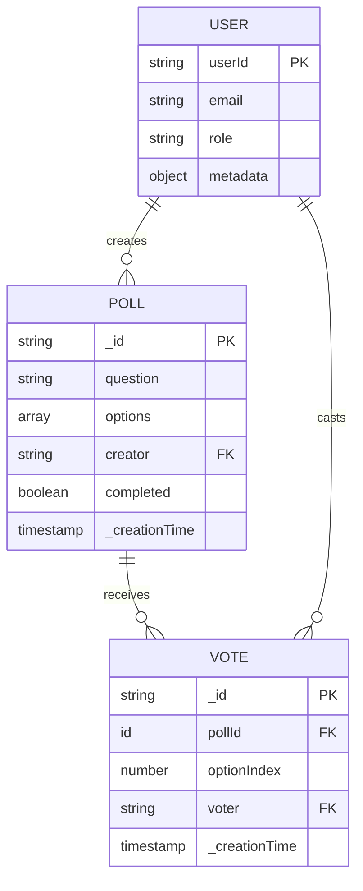

### Convex Schema Definition

The application uses Convex's type-safe schema system:

```typescript
// Poll Schema
poll: defineTable({
  question: v.string(),
  options: v.array(v.string()),
  creator: v.string(), // Clerk user ID
  completed: v.optional(v.boolean()),
})
  .index("by_creator", ["creator"])
  .index("by_option", ["options"]),

// Vote Schema  
vote: defineTable({
  pollId: v.id("poll"),
  optionIndex: v.number(),
  voter: v.string(), // Clerk user ID
})
  .index("by_voter", ["voter"])
  .index("by_poll", ["pollId"])
  .index("by_option", ["optionIndex"])
```

### Data Relationships

#### One-to-Many Relationships
- **User → Polls**: One user can create multiple polls
- **Poll → Votes**: One poll can receive multiple votes
- **User → Votes**: One user can cast multiple votes (on different polls)

#### Business Rules
- **One Vote Per Poll**: Each user can only vote once per poll
- **Creator Privileges**: Poll creators can manage their polls
- **Admin Override**: Admins can manage any poll

---

## Authentication & Authorization

### Authentication Flow

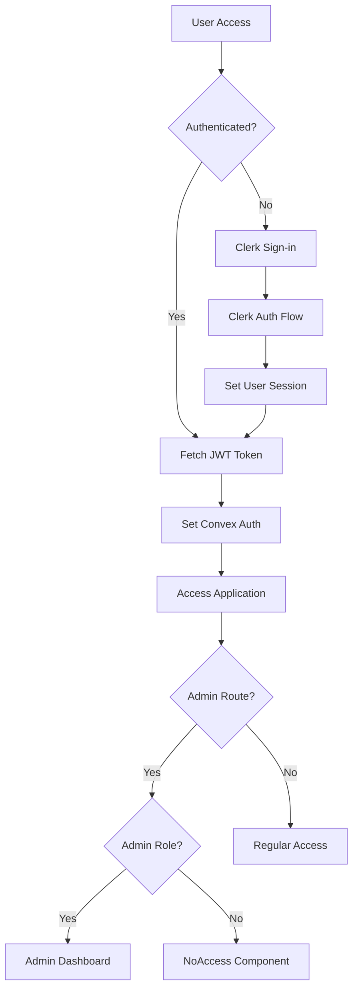

### Role-Based Access Control

#### Role Hierarchy
```typescript
type Roles = 'admin' | 'member'
```

#### Permission Matrix

| Feature | Member | Admin |
|---------|--------|--------|
| View Polls | ✅ | ✅ |
| Create Polls | ✅ | ✅ |
| Vote on Polls | ✅ | ✅ |
| Edit Own Polls | ✅ | ✅ |
| Complete Own Polls | ✅ | ✅ |
| Edit Any Poll | ❌ | ✅ |
| Complete Any Poll | ❌ | ✅ |
| Admin Dashboard | ❌ | ✅ |
| Analytics | ❌ | ✅ |

### Security Implementation

#### Authentication Security
- **JWT Tokens**: Secure, stateless authentication
- **Server-side Validation**: All auth checks happen on the server
- **Auto-refresh**: Tokens refresh automatically
- **Secure Headers**: Proper CORS and security headers

#### Authorization Security
- **Route Protection**: Protected routes check authentication status
- **API Protection**: All Convex functions require authentication
- **Role Verification**: Admin routes verify role membership
- **Resource Ownership**: Users can only modify their own resources

---

## Frontend Architecture

### Component Architecture

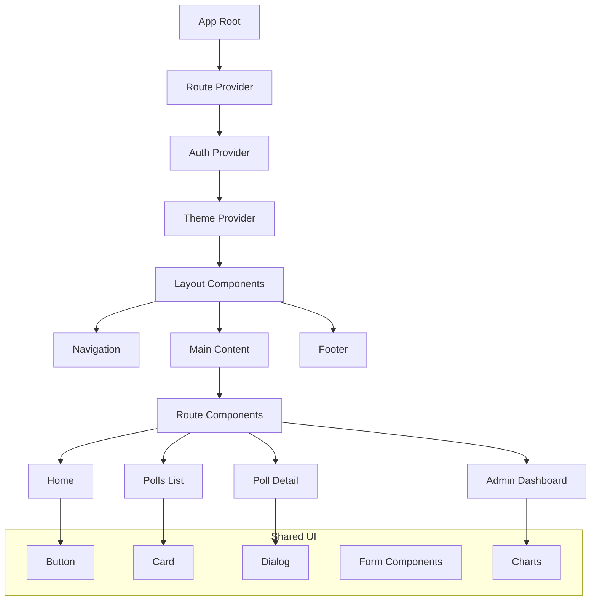

### State Management Strategy

#### Server State (TanStack Query)
- **Polls Data**: Cached and synchronized across components
- **Vote Counts**: Real-time updates via Convex subscriptions
- **User Data**: Cached authentication state
- **Analytics**: Dashboard statistics with automatic refetching

#### Client State (React State)
- **UI State**: Modal open/close, form inputs
- **Theme State**: Dark/light mode preference
- **Navigation State**: Active routes and breadcrumbs

#### State Flow Pattern

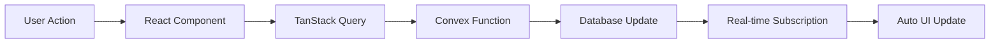

### Routing Architecture

#### Route Structure
```
/ (public)
├── /_authed (requires auth)
│   ├── /polls (polls list)
│   │   └── /$pollId (poll detail)
│   └── /_admin (requires admin role)
│       └── /dashboard (admin analytics)
```

#### Route Protection Pattern
- **Public Routes**: Accessible to all users
- **Authenticated Routes**: Require sign-in
- **Admin Routes**: Require admin role
- **Nested Protection**: Child routes inherit parent protection

---

## Backend Architecture

### Convex Functions Architecture

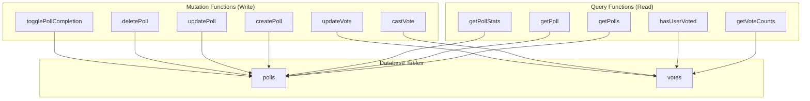

### API Design Patterns

#### Query Functions (Read Operations)
- **Pure Functions**: No side effects, cacheable
- **Type Safety**: Full TypeScript integration
- **Real-time**: Automatic subscription to changes
- **Authorization**: Built-in auth context

#### Mutation Functions (Write Operations)
- **Atomic Operations**: Database consistency guaranteed
- **Validation**: Input validation with Convex validators
- **Authorization**: User-based access control
- **Error Handling**: Comprehensive error responses

### Real-time Features

#### Live Updates
- **Poll Creation**: New polls appear instantly
- **Vote Casting**: Vote counts update in real-time
- **Poll Completion**: Status changes propagate immediately

#### Subscription Pattern
```typescript
// Automatic real-time subscriptions
const { data: polls } = useQuery(
  convexQuery(api.poll.getPolls, {})
);
```

---

## User Experience Design

### Design System

#### Color Palette
- **Primary**: Blue-purple gradient (`oklch(0.5854 0.2041 277.1173)`)
- **Secondary**: Neutral grays for balance
- **Semantic**: Green for success, red for errors/completion
- **Theme Support**: Comprehensive dark/light mode

#### Typography
- **Primary Font**: Plus Jakarta Sans (clean, modern)
- **Monospace**: Roboto Mono for code elements
- **Serif**: Lora for emphasis text

#### Spacing & Layout
- **Container**: Max-width responsive containers
- **Grid System**: CSS Grid and Flexbox for layouts
- **Spacing Scale**: Consistent rem-based spacing

### User Journey Mapping

#### New User Journey
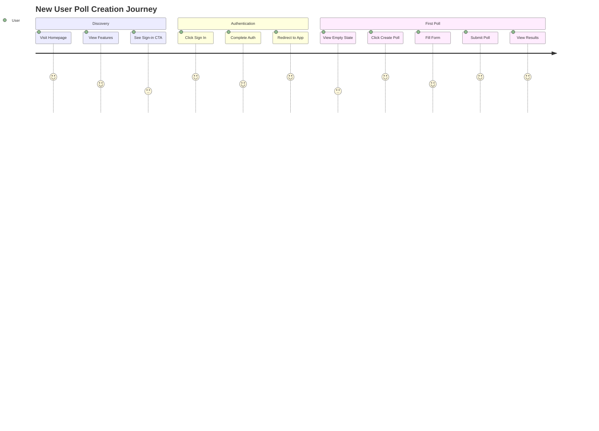

#### Poll Participation Journey
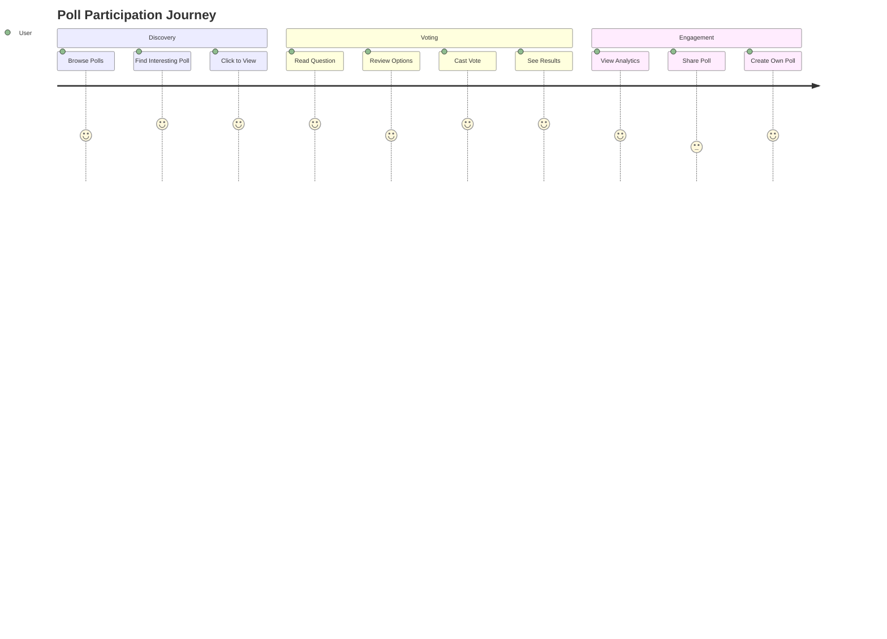

### Accessibility Features

#### WCAG Compliance
- **Keyboard Navigation**: Full keyboard accessibility
- **Screen Readers**: Proper ARIA labels and roles
- **Color Contrast**: WCAG AA compliant color ratios
- **Focus Management**: Clear focus indicators

#### Responsive Design
- **Mobile First**: Designed for mobile, enhanced for desktop
- **Breakpoints**: Tailored for phone, tablet, desktop
- **Touch Targets**: Minimum 44px touch targets

---

## Security Analysis

### Security Layers

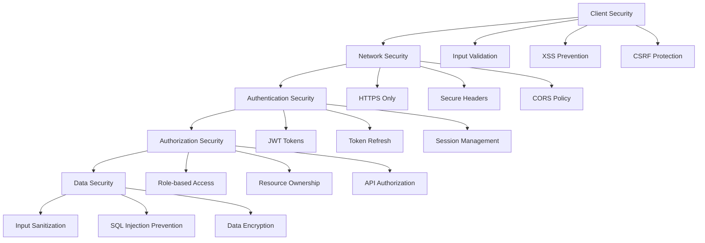

### Security Measures

#### Input Validation & Sanitization
- **Client-side**: React Hook Form with Zod validation
- **Server-side**: Convex validators for all inputs
- **XSS Prevention**: React's built-in XSS protection
- **SQL Injection**: N/A (NoSQL with typed queries)

#### Authentication Security
- **Token-based**: JWT tokens for stateless auth
- **Secure Storage**: Tokens stored in HTTP-only cookies
- **Auto-refresh**: Automatic token renewal
- **Logout**: Proper session cleanup

#### Authorization Security
- **Route Guards**: Protected routes check authentication
- **API Guards**: All functions require valid authentication
- **Role Checks**: Admin functions verify role
- **Resource Guards**: Users can only access their data

### Security Best Practices

#### Implemented
- ✅ HTTPS enforcement
- ✅ Secure authentication flow
- ✅ Input validation on all forms
- ✅ Role-based access control
- ✅ Resource ownership validation
- ✅ Error message sanitization

#### Recommended Enhancements
- 🔄 Rate limiting on poll creation
- 🔄 Audit logging for admin actions
- 🔄 Content Security Policy headers
- 🔄 Regular security dependency updates

---

## Performance Considerations

### Frontend Performance

#### Optimization Strategies
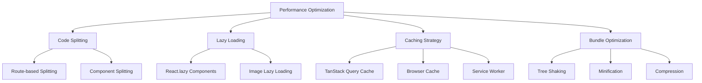

#### Implemented Optimizations
- **Code Splitting**: Route-based code splitting with TanStack Router
- **Query Caching**: Intelligent caching with stale-while-revalidate
- **Bundle Optimization**: Vite's optimized bundling
- **Tree Shaking**: Automatic dead code elimination

#### Performance Metrics
- **First Contentful Paint**: Target < 1.5s
- **Largest Contentful Paint**: Target < 2.5s
- **Time to Interactive**: Target < 3.5s
- **Bundle Size**: Optimized with dynamic imports

### Backend Performance

#### Database Optimization
- **Indexes**: Strategic indexing on query patterns
- **Query Optimization**: Efficient query patterns
- **Real-time Efficiency**: Optimized subscription patterns

#### Scaling Considerations
- **Convex Scaling**: Automatic horizontal scaling
- **CDN**: Static asset delivery optimization
- **Caching**: Multi-layer caching strategy

---

## Development Workflow

### Build System Architecture

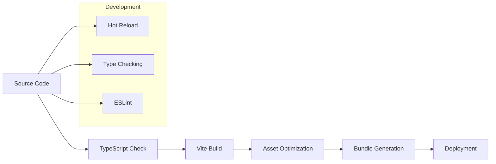

### Development Environment

#### Local Development
```bash
# Start development server
pnpm dev

# Build for production
pnpm build

# Start production server
pnpm start
```

#### Development Tools
- **Vite**: Fast HMR and development server
- **TypeScript**: Real-time type checking
- **TanStack Router Devtools**: Route debugging
- **TanStack Query Devtools**: State inspection

### Code Organization

#### File Structure Pattern
```
src/
├── components/          # Reusable UI components
│   ├── ui/             # Base UI primitives
│   └── [Feature]Dialog.tsx # Feature-specific components
├── routes/             # File-based routing
│   ├── __root.tsx      # Root layout
│   ├── index.tsx       # Home page
│   └── _authed/        # Protected routes
├── lib/                # Utility libraries
│   ├── utils/          # Helper functions
│   └── types/          # TypeScript types
└── styles/             # Global styles
```

#### Component Patterns

##### UI Component Pattern
```typescript
// Consistent prop interface
interface ComponentProps {
  readonly children?: React.ReactNode;
  readonly className?: string;
  readonly variant?: 'default' | 'secondary';
}

// Forward refs for composition
const Component = React.forwardRef<HTMLElement, ComponentProps>(
  ({ children, className, ...props }, ref) => {
    return (
      <Element
        ref={ref}
        className={cn(baseStyles, className)}
        {...props}
      >
        {children}
      </Element>
    );
  }
);
```

##### Data Component Pattern
```typescript
// Query hooks for data fetching
function usePolls() {
  return useQuery({
    ...convexQuery(api.poll.getPolls, {}),
    staleTime: 5 * 60 * 1000, // 5 minutes
  });
}

// Mutation hooks for data updates
function useCreatePoll() {
  return useConvexMutation(api.poll.createPoll);
}
```

---

## Scalability & Future Considerations

### Scaling Architecture

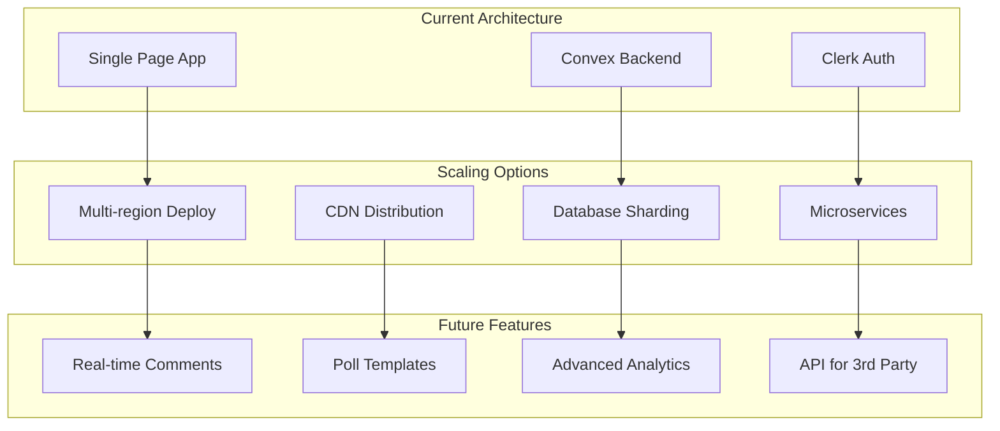

### Technical Debt Assessment

#### Low Priority
- ✅ Type safety across the stack
- ✅ Modern React patterns
- ✅ Consistent code style
- ✅ Component reusability

#### Medium Priority
- 🔄 Test coverage improvement
- 🔄 Error boundary implementation
- 🔄 Loading state standardization
- 🔄 Internationalization preparation

#### High Priority
- 🔄 Comprehensive error handling
- 🔄 Performance monitoring
- 🔄 Accessibility audit
- 🔄 Security audit

### Feature Roadmap

#### Phase 1: Core Enhancements
- **Poll Templates**: Pre-built poll templates
- **Advanced Voting**: Ranked choice voting
- **Poll Scheduling**: Time-based poll activation
- **Export Features**: PDF/CSV export of results

#### Phase 2: Collaboration Features
- **Poll Comments**: Discussion on polls
- **Poll Sharing**: Social media integration
- **Team Workspaces**: Multi-user poll management
- **Real-time Collaboration**: Live poll editing

#### Phase 3: Analytics & Insights
- **Advanced Analytics**: Demographic analysis
- **Trend Analysis**: Historical voting patterns
- **Custom Reports**: Automated report generation
- **Integration APIs**: Third-party tool integration

---

## Code Quality & Maintainability

### Code Quality Metrics

#### Type Safety
- **TypeScript Coverage**: 100% TypeScript usage
- **Strict Mode**: Enabled across the project
- **Type Inference**: Leveraging TypeScript inference
- **Runtime Validation**: Zod schemas for runtime safety

#### Code Consistency
- **ESLint**: Consistent code formatting (ready for setup)
- **Prettier**: Code formatting (ready for setup)
- **File Naming**: Consistent naming conventions
- **Import Organization**: Clean import structure

### Architecture Patterns

#### Design Patterns Used

##### Compound Component Pattern
```typescript
// Dialog component with sub-components
<Dialog>
  <DialogHeader>
    <DialogTitle>Create Poll</DialogTitle>
  </DialogHeader>
  <DialogContent>
    {/* Form content */}
  </DialogContent>
</Dialog>
```

##### Custom Hooks Pattern
```typescript
// Encapsulated logic in custom hooks
function usePollManagement() {
  const createPoll = useCreatePoll();
  const updatePoll = useUpdatePoll();
  
  return {
    createPoll,
    updatePoll,
    isLoading: createPoll.isPending || updatePoll.isPending
  };
}
```

##### Provider Pattern
```typescript
// Context providers for shared state
<ThemeProvider>
  <AuthProvider>
    <QueryProvider>
      <App />
    </QueryProvider>
  </AuthProvider>
</ThemeProvider>
```

### Testing Strategy (Recommended)

#### Unit Testing
- **Components**: React Testing Library
- **Hooks**: React Hooks Testing Library
- **Utilities**: Jest for pure functions
- **API Functions**: Convex testing utilities

#### Integration Testing
- **User Flows**: Playwright for E2E testing
- **API Integration**: Test Convex functions
- **Authentication**: Test auth flows
- **Real-time**: Test subscription behavior

#### Performance Testing
- **Bundle Analysis**: Webpack Bundle Analyzer
- **Core Web Vitals**: Lighthouse CI
- **Load Testing**: Test real-time scaling
- **Memory Profiling**: React DevTools Profiler

---

## Conclusion

### Project Strengths

#### Technical Excellence
- **Modern Stack**: Cutting-edge technologies and patterns
- **Type Safety**: Full TypeScript coverage
- **Real-time**: Seamless live updates
- **Performance**: Optimized for speed and efficiency

#### Developer Experience
- **Fast Development**: Hot reloading and instant feedback
- **Type Safety**: Compile-time error detection
- **Tooling**: Excellent debugging and development tools
- **Documentation**: Clear code and architecture patterns

#### User Experience
- **Responsive Design**: Works across all devices
- **Accessibility**: Designed for all users
- **Performance**: Fast loading and interactions
- **Intuitive**: Clear user interface and flows

### Areas for Enhancement

#### Immediate Opportunities
1. **Testing**: Implement comprehensive test suite
2. **Error Handling**: Enhance error boundaries and recovery
3. **Performance**: Add performance monitoring
4. **Documentation**: Expand inline code documentation

#### Long-term Vision
1. **Scalability**: Prepare for high-volume usage
2. **Features**: Expand poll functionality
3. **Integrations**: API for third-party applications
4. **Analytics**: Advanced reporting and insights

This codebase represents a well-architected, modern web application that balances developer experience, user experience, and technical excellence. It serves as an excellent foundation for a production polling platform with clear paths for enhancement and scaling.
